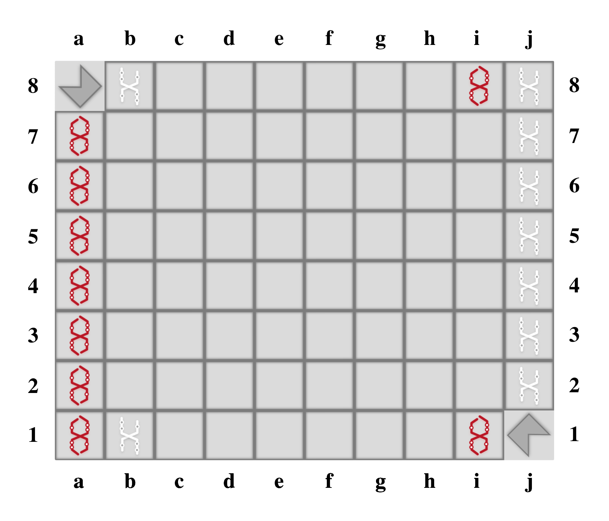

## Laser Algebraic Notation (for Laser Chess)

Algebraic notation (or AN) is the standard method for recording and describing the moves in a game of [chess](https://en.wikipedia.org/wiki/Chess). Built upon that idea, this a notation modified for the game of [Laser Chess](https://en.wikipedia.org/wiki/Laser_Chess), and we are calling it **Laser Algebraic Notation** (or **LAN**)

Just as the Chess Algebraic Notation, **LAN** is based on a system of [coordinates](https://en.wikipedia.org/wiki/Coordinates) to uniquely identify each piece (and it's movements) and squares on the board.

## Naming the squares

Each square of the board is identified by a unique coordinate pair—a letter and a number—from the Blue/White's point of view.

- The vertical columns of squares are labeled ***a*** through ***j*** from Blue/White's left to right (the laser). 

- The horizontal rows of squares are numbered ***1*** to *8* starting from White's side of the board. Thus each square has a unique identification of file letter followed by rank number. For example, the initial square of White's king is designated as "e1".

## Naming the piece

Each piece, is identified by an uppercase letter.
The identification is the first letter of the piece name, except for the **Deflector** which is **B** (because D for Deflector would be confused with the one of the Defender. *The letter B came from Bend–bending the light*).

| Name      | Identification |
| --------- | -------------- |
| King      | K              |
| Switch    | S              |
| Defender  | D              |
| Deflector | B              |
| Laser     | L              |

## Naming the players

There are only two (2) players per game. Each player has pieces of one color. So in total there are two colors. 
Any player may choose to play with:

1. Blue/White pieces
2. Red/Gray pieces

## Notation for moves

Each move of a piece is indicated by the piece's uppercase letter, plus the coordinate of the destination square. For example, **Be5** (move a Deflector to *e5*), **Df3** (move a Defender to *f3*).

- Laser is not a movable piece (see Game Rules) hence no moves, by any pieces, are allowed on the squares *j1* and *a8*.

  

### Captures

Captures
